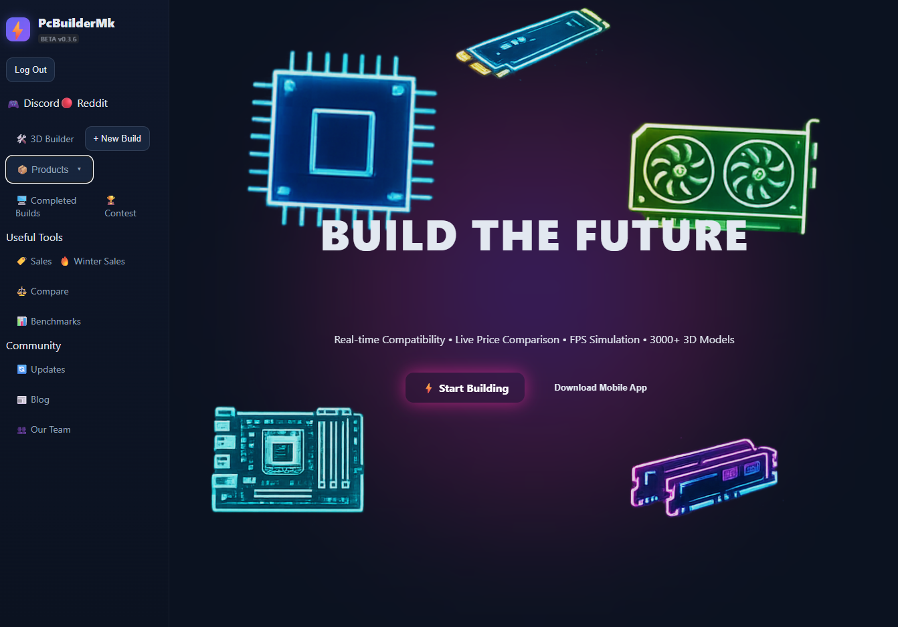
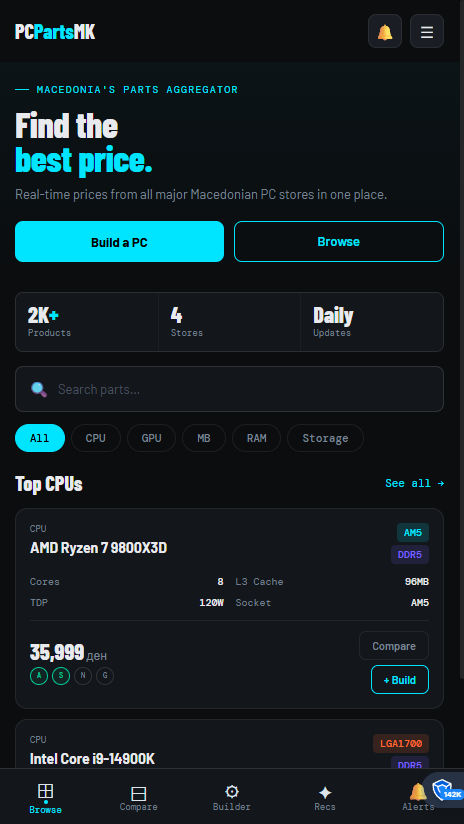
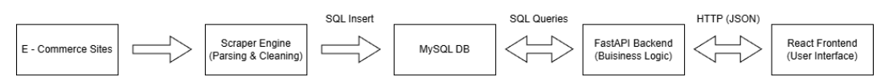
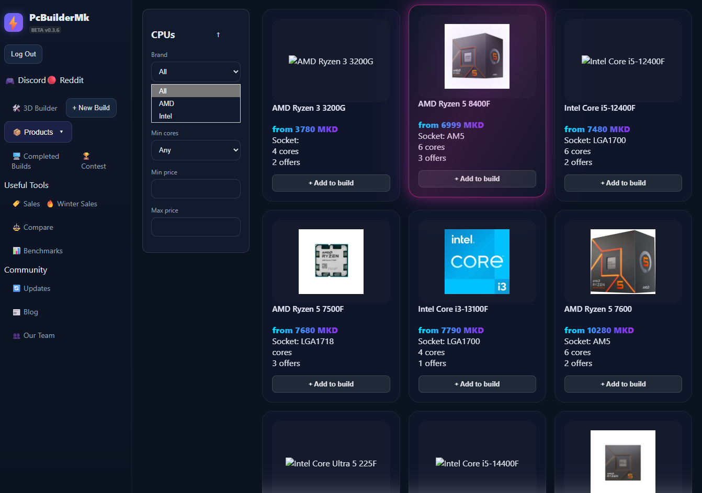
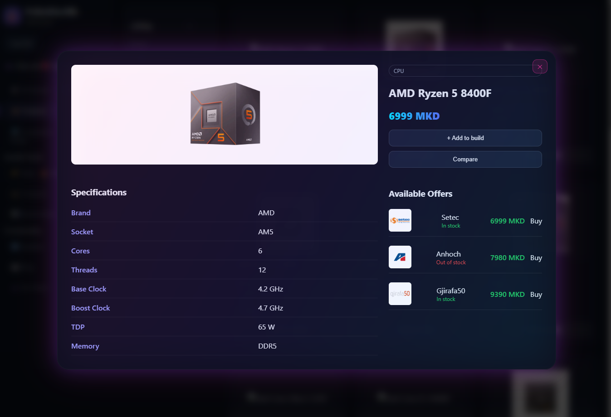
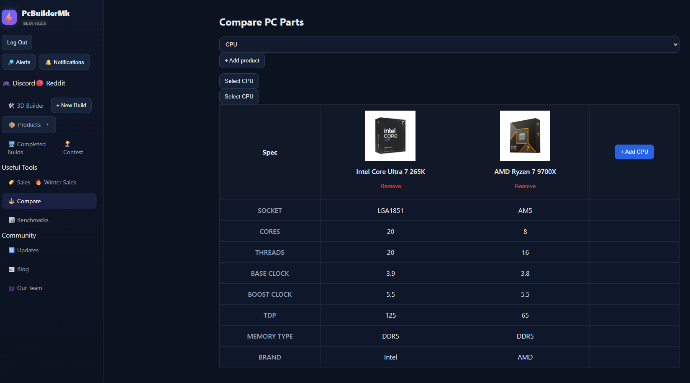
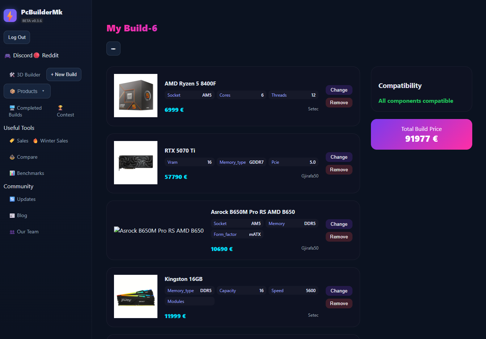

# PcParts.Mk
 
A PC parts price-comparison and build-planning platform for the Macedonian market. It scrapes live offers from local computer stores, normalizes them into a single catalog, and lets users search, compare, build, and get budget-based recommendations all in one place.
 
🔗 **Live demo:** [pc-parts-mk.vercel.app](https://pc-parts-mk.vercel.app)

     
## What it does
 
- **Live price scraping**  scheduled scrapers pull current listings from Macedonian retailers (Neptun, Setec, Gjirafa, Anhoch) and normalize them into a shared schema (brand, model, specs, price, stock status).
- **Product catalog & search**  browse CPUs, GPUs, motherboards, RAM, and storage with filtering and pagination.
- **Compare**  put up to 4 products from the same category side by side.
- **PC Builder**  assemble a full build slot by slot (CPU, GPU, motherboard, RAM, storage) with live compatibility checks: CPU/MB socket matching and CPU-MB/RAM memory-type matching.
- **Budget recommendations**  pick a budget and a usage profile (e.g. gaming, workstation) and get an auto-generated parts list, including PSU sizing based on estimated component draw.
- **Price alerts**  save an alert for a category/title/store/price ceiling and get notified when a matching offer appears; checked by a background scheduler.
- **Accounts**  JWT-based auth for saved builds, alerts, and notifications.
## Architecture
 
This is a three-service system:
 

 
- **`backend/`**  FastAPI REST API. Routers for auth, users, alerts, notifications, builder, compare, recommend, and per-category product listings (CPU/GPU/MB/RAM/storage). Includes a background APScheduler job for periodic alert checks, security headers middleware, and request logging.
- **`frontend/`**  React 19 + Vite SPA. Category pages, product flyouts, a comparison view, the PC builder UI, recommendation flow, alerts panel, and notifications overlay. Served through nginx in production, which also proxies API calls.
- **`pipeline/`**  Scraper and data-enrichment pipeline. Runs per-store scrapers, normalizes offers into a common schema, upserts them into MySQL, marks stale offers out of stock, and enriches product specs. Runnable standalone (`pipeline.py`) with `--phase scrape|enrich`, `--dry-run`, and `--workers` flags, or on a schedule via `scheduler.py`.
## Tech stack
 
| Layer | Stack |
|---|---|
| Frontend | React 19, Vite, React Router |
| Backend | FastAPI, Pydantic v2, PyJWT, bcrypt, APScheduler |
| Database | MySQL 8 |
| Pipeline | Python, `mysql-connector-python`, custom scrapers per retailer |
<table>
  <tr>
    <td width="50%"></td>
   <td width="50%"></td>
    
  </tr>
  <tr>
    <td align="center">Product listing with filters</td>
   <td align="center">Product details</td>
    
  </tr>
  <tr>
    <td width="50%"></td>
    <td width="50%"></td>
  </tr>
  <tr>
    <td align="center">Product compare</td>
    <td align="center">My Builds</td>
  </tr>
</table>
